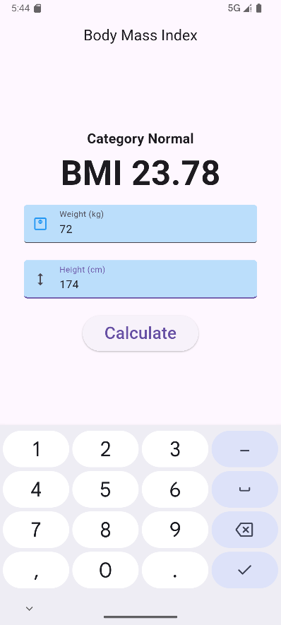

# bmi_app

A basic flutter app to calculate the BMI.

## Availability

| Platform | Is available |
|----------|--------------|
| ANDROID  | yes          |
| IOS      | no           |
| WINDOWS  | no           |
| LINUX    | no           |
| WEB      | no           |

## Getting Started

To install the app you can download the latest apk from the [github release](https://github.com/shreyanshu-shubham/bmi_app/releases) pages and install it on your phone

## Screenshots

|       Splash Screen       |     Calculation Page      |
|:-------------------------:|:-------------------------:|
|  |  |